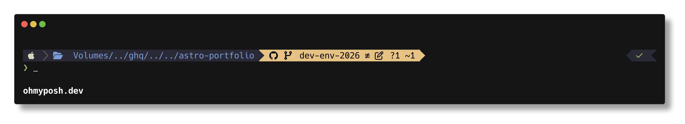

年度末ということで自分も書いてみようと思います。

## OS

業務もプライベートもmacOSを使っています。

プライベートマシンはM2 Pro Mac miniを利用しています。
特に不便なく利用出来ていますが、32GB RAMだとパラメーター数の大きなLLMは動かせないのでM5 Mac mini/Studioが出たら買い替えを検討しています。

自宅サーバーとしてUbuntuを載せたMINISFORUMのミニPCがありますが、[Homebridge](https://homebridge.io/) を動かしているくらいであまり活用はできてはいないです。

## エディタ

2023年ごろからNeoVimを使っています。
ディストリビューションとして [AstroNvim](https://astronvim.com/) を入れており、こちらをベースに自分なりにカスタマイズしています。

Jupyter Notebookを触る場合にのみVScodeを使っていましたが、最近はNotebook環境も[marimo](https://marimo.io/)を使うようになり、NoeVimで完結出来るようになったため、ほとんど起動する機会はないです。

## シェル



zshを使っています。

プラグインマネージャーにはSheldonを使っています。
使い方として正しいのか分からないのですが、遅延読み込みしないものやプラグイン以外のものもインラインで定義しておいて`.zshrc`が散らからないようにしています。

```sh
[plugins.zoxide]
inline = 'eval "$(zoxide init zsh)"'
````

プロンプトには [oh-my-posh](https://ohmyposh.dev/) を使っています。

元々はpowerlevel10kを使っており、メンテモードに入ってからはstarshipに移行していました。
ただ、starshipにはp10kの [Show on command](https://github.com/romkatv/powerlevel10k?tab=readme-ov-file#show-on-command) と同等の機能がなく、
他のプロンプトを検討したところ [Tooltips](https://ohmyposh.dev/docs/configuration/tooltips) のあるoh-my-poshに落ち着きました。

見た目も綺麗で、機能も十分なので気に入ってます。


## ターミナルエミュレータ

luaで設定が記述でき、NeoVimとの相性が良いので [WezTerm](https://wezterm.org/index.html) を使っています。

ターミナルマルチプレクサなどは特に入れずにWezTerm標準のタブやWorkspaces機能で十分満足しています。
キーマップはtmuxライクにし、[tabline.wez](https://github.com/michaelbrusegard/tabline.wez) を入れてタブバーの見た目をカスタマイズしています。

フォントに [HackGen](https://github.com/yuru7/HackGen) を、カラースキームは [kanagawa](https://github.com/rebelot/kanagawa.nvim) を設定しています。


## コーディングエージェント

会社環境の都合上、Codexをメインに使っています。

## dotfiles

[yadm](https://yadm.io/) を使って管理しています。

世間的にはchezmoiユーザーが多いようですが、`dot_config`のような名前で管理するのに違和感あったのでこちらを使っています。

https://github.com/fuchami/dotfiles/tree/main

## Git/GitHub関連

TUIツールとしてlazygit を入れています。

最近はIssueやPRの作成/編集もターミナルで完結したくなってきたのでOcto.nvimやgh-dashを試したりしています。

## ウィンドウマネージャー

ずっとRectangleとhammerspoonを使っていたのですが、今年の1月ごろに [AeroSpace](https://nikitabobko.github.io/AeroSpace/guide) へ移行しました。

タイリングウィンドウマネージャは初めてで慣れが必要でしたが、ようやく身体に馴染んできました。
困る場面としては、ミーティングでの画面共有時くらいでしょうか。

## ランチャー

macOS標準のSpotlightを使っていましたが最近 [RayCast](https://www.raycast.com/) を導入しました。
クリップボードやスニペット管理に使っていたClipyもやめてRayCastでまとめられたのは良かったです。

## その他ツール・アプリ

### karabiner-elements

以下の設定を入れています。

- Ctrl+\[をしたときに英数キーも送信する
- escキーを押したときに、英数キーも送信する
- コマンドキー(左右どちらでも)を単体で押したときに、英数・かなをトグルで切り替える
- Exchange semicolon and colon

--- 

## 物理環境

- キーボード
  - HHKBを使っています
  - イキって無刻印を購入したのですが流石に数字入力が辛いので「6」の部分を青色キートップに変えています
- マウス/トラックボール
  - LogicoolのMX Ergoを使っています
- モニター
  - LGの32インチ4Kモニターを使っています
- デスク
  - ロウヤのデスクを使っています
  - めちゃめちゃ高いですが、いずれPREDUCTSデスクを購入したいです
- チェア
  - 中古で買ったハーマンミラーのアーロンチェアを使っています
  - ガスシリンダーの調子が悪いので、こちらもいずれ買い替えたいです

## おわりに

こういう開発環境を整えるのは好きで、気になったツールは積極的に試すようにしています。

CUI/TUIツールを多用しているのはGUIが苦手なのと、純粋に「カッコいいから」です。
気分が上がると業務効率も上がると考えています。
